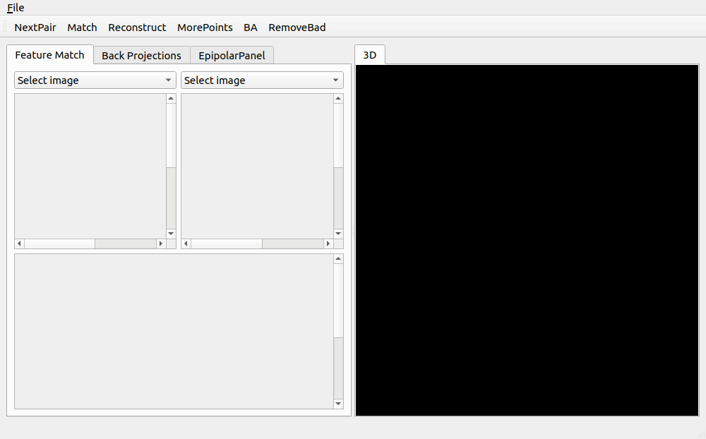

# Manual Structure From Motion

## Overview
This tool enables user to load a sequence of images and do sparse 3D point cloud reconstruction.

## Key Features
1. Visualization of keypoint matches between pair of images.
2. Allow user to manually remove bad matches before reconstruction (which automated softwares do not offer).
3. Auto recommend next pair of images to match.
4. Bundle adjustment.
5. Visualization of reconstructed point cloud and camera pose.

## Required Libraries
1. Qt4 with VTK
2. LibCVD
3. Agast
4. tinyxml2 (unecessary dependency planning of removal)

## Compile
1. cmake .
2. make
