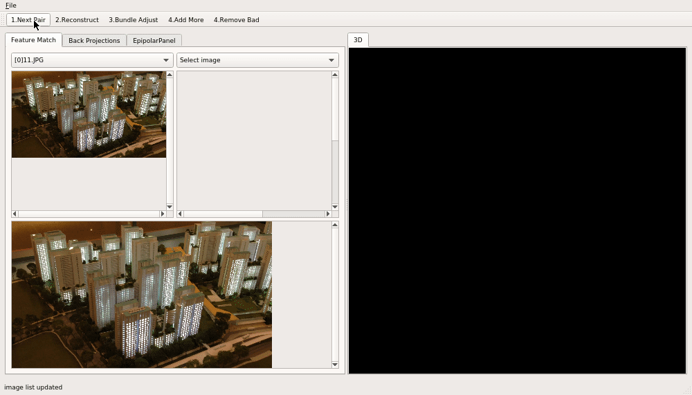

# Manual Structure From Motion


## Overview
This tool enables user to load a sequence of images and do sparse 3D point cloud reconstruction.

## Key Features
1. Break structure from motion workflow into steps which helps inspection/understanding (not offered by most similar softwares).
2. Free to choose images to match but can also auto recommend next pair of images to match.
3. Visualization of reconstructed point cloud and camera poses.
4. Visualization of keypoint matches between pair of images used for reconstructing the 3D scene.
5. Visualization of backprojected 3D points onto images.
6. Visualization of epiplar line.

## Build Environment
Ubuntu 18.04 and above (due to the required versions of apt installed libraries).

## Build Commands
1. Apt install dependencies
```
$> sudo apt update
$> sudo apt install build-essential git cmake libvtk6-qt-dev libopencv-dev libceres-dev
```
2. Create /build folder under /MSFM
```
$> mkdir build
$> cd build
```
3. build
```
$> cmake ..
$> make
```

## Run
Under build folder, type
```
$> ./src/ManualSFM
```

## Run Tests
Under build folder, type
```
$> ./tst/ManualSFM_tst
```
